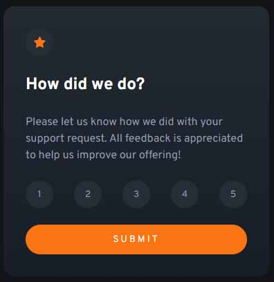
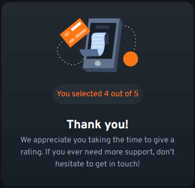

# Frontend Mentor - Interactive rating component solution

This is a solution to the [Interactive rating component challenge on Frontend Mentor](https://www.frontendmentor.io/challenges/interactive-rating-component-koxpeBUmI). Frontend Mentor challenges help you improve your coding skills by building realistic projects.

## Table of contents

- [Frontend Mentor - Interactive rating component solution](#frontend-mentor---interactive-rating-component-solution)
  - [Table of contents](#table-of-contents)
  - [Overview](#overview)
    - [The challenge](#the-challenge)
    - [Screenshot](#screenshot)
  - [My process](#my-process)
    - [Built with](#built-with)
    - [What I learned](#what-i-learned)
    - [Continued development](#continued-development)
    - [Useful resources](#useful-resources)
  - [Author](#author)

**Note: Delete this note and update the table of contents based on what sections you keep.**

## Overview

### The challenge

Users should be able to:

- View the optimal layout for the app depending on their device's screen size
- See hover states for all interactive elements on the page
- Select and submit a number rating
- See the "Thank you" card state after submitting a rating

### Screenshot

Desktop

Mobil

## My process

### Built with

- HTML5
- CSS
- Grid
- Flexbox
- JS

### What I learned

- Using for loop to find clicked item
- Adding text content to HTML element with JS
- Changing CSS style with JS by clicking on a button

### Continued development

This is the very beginning of my journey.
I still want to practice HTML and CSS, learn Bootstrap and Tailwind while moving to learn JS too.

### Useful resources

- [Dave Gray](https://www.youtube.com/c/DaveGrayTeachesCode) - I learnt about DOM manipulation
- [freeCodeCamp](https://www.freecodecamp.org/) - I learnt basic JS from here too.
- [ZTM Academy](https://zerotomastery.io/) - I am taking the Web Dev course from here

## Author

- Frontend Mentor - [@K-Muzslay](https://www.frontendmentor.io/profile/K-Muzslay)
